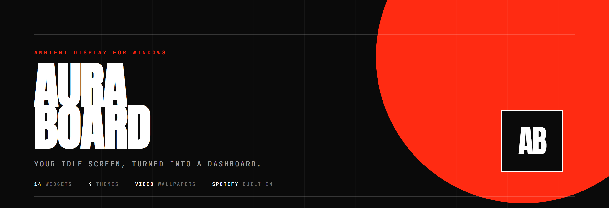
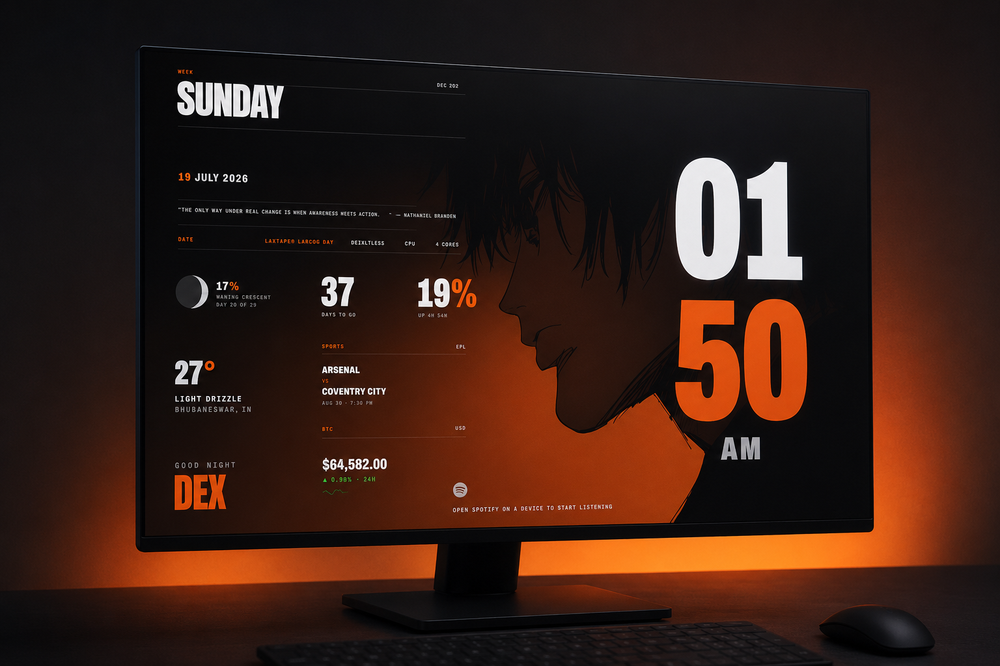
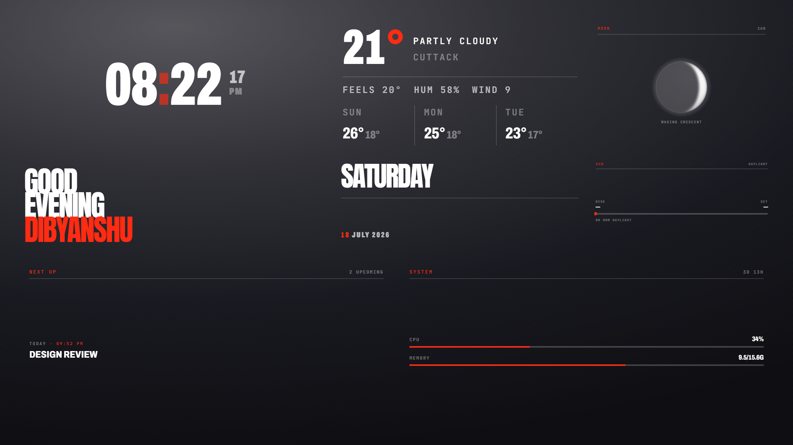
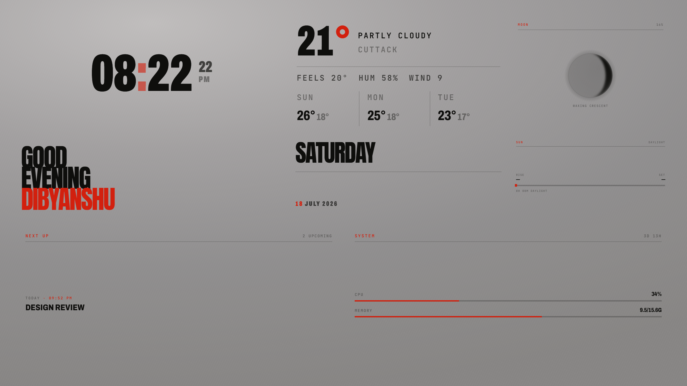
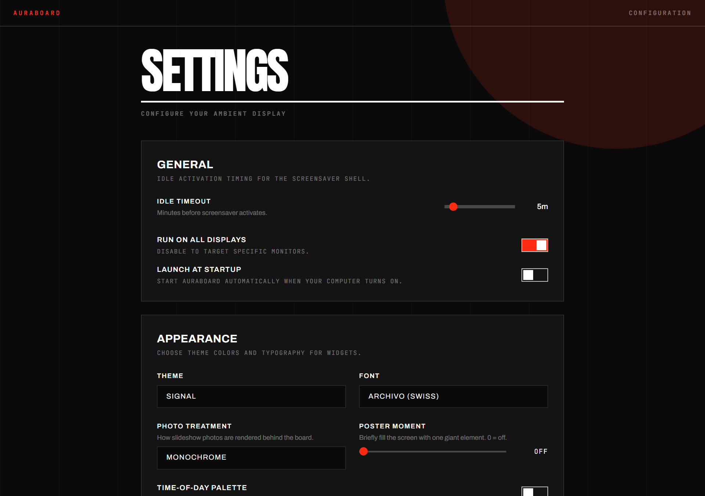
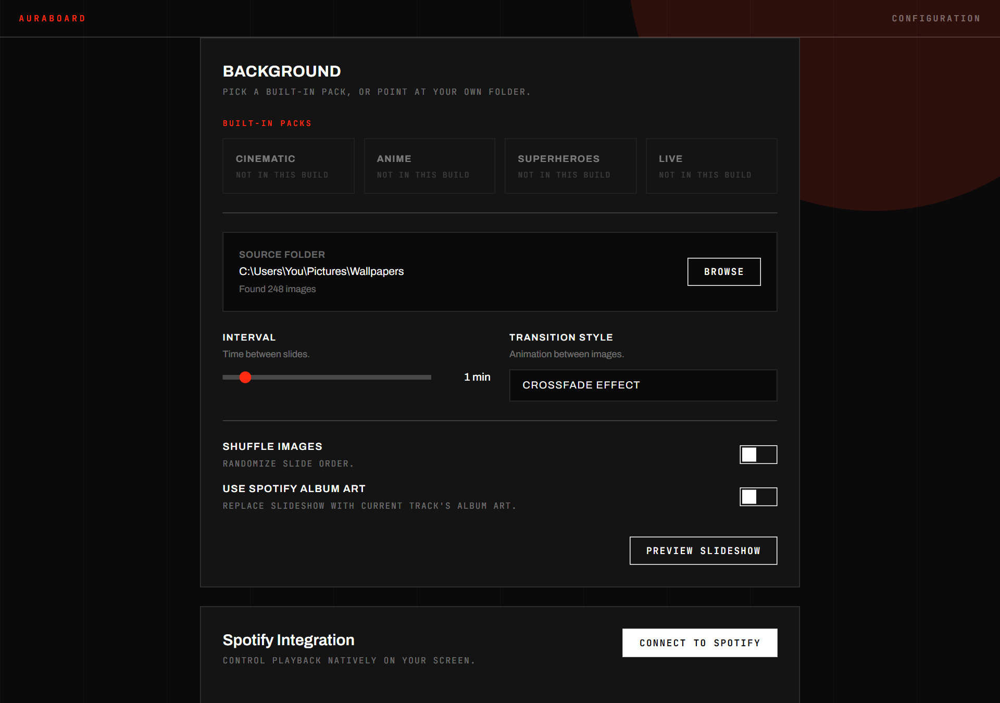

<div align="center">



**Your idle screen, turned into a dashboard.**

A product by **[DexForge](https://dexforge.iamdex.codes)**

AuraBoard replaces the blank Windows screensaver with a designed ambient display —
a full-screen photo or video slideshow with live widgets laid out exactly how you want them.

[](https://github.com/dexisworking/auraboard/releases/latest)
[](https://github.com/dexisworking/auraboard/releases)
[](LICENSE)
[](https://dexforge.iamdex.codes)
[](#installation)
[](https://buymeacoffee.com/dexisworking)

</div>

---



<div align="center">
<sub>AuraBoard on the Ember theme — clock, date, weather, moon phase, countdown, system, sports and crypto over a full-bleed wallpaper.</sub>
</div>

## Why AuraBoard

Your machine sits idle for hours a day showing nothing. AuraBoard turns that dead
screen into something worth glancing at — the time, the weather, your next meeting,
what's playing — set against your own wallpapers, in a deliberate Swiss-inspired
visual language rather than the usual widget-soup.

- **It looks designed.** Ultra-condensed display type, one signal colour on a mono
  ground, hairline rules, square corners. Every widget ships in three visual variants.
- **It's yours to arrange.** Drag, resize and overlap widgets on a 12×12 grid. Layouts
  persist and survive restarts.
- **It stays out of the way.** Lives in the tray, wakes on idle, dismisses on input.

## Features

| | |
|---|---|
| **14 widgets** | Clock · Date · Greeting · Weather · Moon · Sun · Calendar · Countdown · System · Spotify · News · Crypto · Stocks · Sports |
| **Photo & video slideshow** | Point at any folder. JPEG/PNG/WebP/GIF plus MP4/WebM/MOV — videos loop, always muted |
| **Free-form layout editor** | Drag-and-drop, resize from any edge, overlap freely, per-widget style variants |
| **4 themes** | Signal · Newsprint · Cyan · Amber, with optional time-of-day palette drift |
| **Spotify integration** | Now-playing, transport controls, optional album-art background |
| **Multi-monitor** | Run on every display or pick specific ones |
| **Photo treatments** | Monochrome, duotone, or untouched — tuned for text legibility over any image |

<div align="center">

| Signal theme | Newsprint theme |
|:---:|:---:|
|  |  |

</div>

## Installation

### Download (recommended)

Two builds are available on the [latest release](https://github.com/dexisworking/auraboard/releases/latest):

| Download | Size | Notes |
|---|---|---|
| `AuraBoard-Setup-1.0.0.exe` | 80 MB | Standard installer. Bring your own wallpaper folder |
| `AuraBoard-Setup-1.0.0-predefined.exe` | 498 MB | Same app, plus 4 built-in packs: Cinematic, Anime, Superheroes, Live |
| `AuraBoard-1.0.0-portable.zip` | 109 MB | No installer — extract and run `AuraBoard.exe` |

The predefined build bundles 118 wallpapers (106 images plus 12 looping 4K video
wallpapers) so it works straight out of the box.

1. Download one and run it
2. AuraBoard starts in your system tray — right-click the icon for **Settings**

> [!TIP]
> **If your browser deletes the download**, that's SmartScreen reputation filtering, not
> a virus — unsigned installers from new publishers get discarded automatically. Use the
> **portable ZIP** instead; archives are rarely blocked. You can also choose *Keep* in
> your browser's download list, or verify the SHA-256 published on the
> [release](https://github.com/dexisworking/auraboard/releases/latest) first.

> [!NOTE]
> **Windows SmartScreen will warn you on first run.** The installer isn't code-signed
> (certificates cost a few hundred dollars a year). Click **More info → Run anyway**.
> If you'd rather not trust a binary, [build it yourself](#build-from-source) — it takes two commands.

**Requirements:** Windows 10 or 11 (x64). No runtime dependencies — everything is bundled.

### Portable

Prefer no installer? Download `AuraBoard-1.0.0-portable.zip`, extract it anywhere, and
run `AuraBoard.exe`. Nothing is written to Program Files and no registry keys are set —
though that also means AuraBoard won't register itself as your Windows screensaver, so
you'll launch it manually or add it to startup yourself.

### Build from source

```bash
git clone https://github.com/dexisworking/auraboard.git
cd auraboard
npm install
npm run dev          # live-reload development
npm run build:win    # produces release/AuraBoard-Setup-<version>.exe
```

Requires Node.js 20+ and npm.

## Getting started

Once installed, right-click the tray icon:

- **Settings** — idle timeout, wallpaper folder, theme, widget data sources, Spotify
- **Layout Editor** — add/remove widgets, then drag and resize them into place
- **Preview** — see the board immediately without waiting to go idle



### Choosing wallpapers

Open **Settings → Background → Browse** and point AuraBoard at any folder. It scans
recursively and picks up both images and video.



### Wallpaper packs

AuraBoard supports bundled wallpaper packs, shown in **Settings → Background**. The
predefined installer ships with all four filled; in the standard installer the slots
appear as *Not in this build*. To build your own packs:

1. Edit the `PACKS` array in [`electron/packs.js`](electron/packs.js) to point at your folders
2. Run `npm run packs:sync` to copy the media into `packs/`
3. Run `npm run build:win` — packs are bundled automatically

Use `npm run build:win:nopacks` for a clean, distributable build.

> [!IMPORTANT]
> Only bundle media you have the right to redistribute. Wallpapers pulled from the
> internet are usually someone's copyrighted work.

## Configuration

| Setting | What it does |
|---|---|
| **Idle timeout** | Minutes of inactivity before the board appears |
| **Interval** | Seconds per slide (videos loop for the full interval) |
| **Transition** | Fade, slide, or zoom, with a slow Ken Burns drift on stills |
| **Photo treatment** | `monochrome` · `duotone` · `none` |
| **Time-of-day palette** | Tints the board by dawn/day/dusk/night |
| **Poster moment** | Periodically blows one element up to fill the screen |

API keys for News, Stocks and Crypto are optional and stored encrypted via the OS
keychain (DPAPI on Windows).

## How it works

AuraBoard is an Electron app with a React renderer.

- **Main process** owns idle detection, window management, and a shared data layer
  (`electron/services/`) with TTL caching, single-flight de-duplication and
  stale-on-error fallback — so three monitors don't mean three times the API calls.
- **Renderer** draws the board. Widgets size themselves to their grid cell using CSS
  container queries, so any widget works at any size.
- **Media** is served over a custom `auraboard-media://` protocol restricted to your
  chosen folders, which keeps Chromium's `webSecurity` fully enabled.
- **Secrets** go through Electron `safeStorage`; nothing is stored in plaintext.

**Stack:** Electron 33 · React 19 · electron-vite · Tailwind · react-grid-layout

## Scripts

| Command | Purpose |
|---|---|
| `npm run dev` | Development with live reload |
| `npm run build` | Build app bundles |
| `npm run build:win` | Windows installer with packs bundled, named `-predefined` |
| `npm run build:win:nopacks` | Windows installer with empty packs |
| `npm run packs:sync` | Copy pack media from source folders into `packs/` |
| `npm run lint` | ESLint |

## Contributing

Issues and pull requests are welcome. For a new widget, add an entry to
[`src/widgets/registry.js`](src/widgets/registry.js) with its default/min/max size,
its style variants, and any per-instance settings — the layout editor and settings
UI build themselves from that registry.

## Privacy

AuraBoard has no server, no account, no telemetry and no analytics. Settings stay in
`%APPDATA%\auraboard\`, and widgets call public APIs directly from your machine — the
developer receives nothing. See [PRIVACY.md](PRIVACY.md) for the full breakdown of what
each widget contacts and when.

## Support

AuraBoard is free and open source. If it earns a place on your screen, you can support
development at **[buymeacoffee.com/dexisworking](https://buymeacoffee.com/dexisworking)** ☕

## License

[MIT](LICENSE) © 2026 [DexForge](https://dexforge.iamdex.codes)

The MIT licence covers AuraBoard's source code. Any wallpapers, artwork or media you
add remain under their own licences.

---

<div align="center">

**AuraBoard** is built and maintained by **[DexForge](https://dexforge.iamdex.codes)** —
secure software engineering and product development.

</div>
